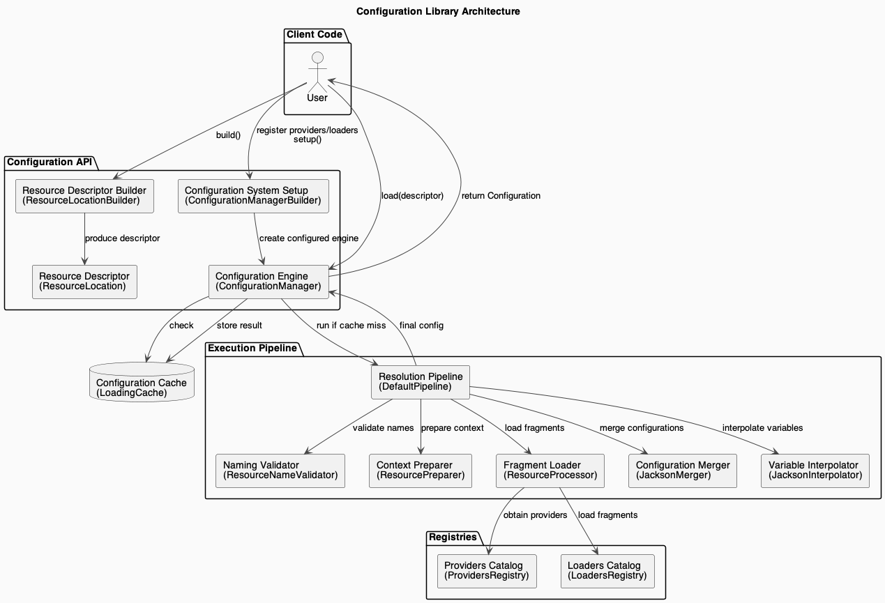

# Liana Config

## Overview

**Liana** is a lightweight, framework-agnostic Java configuration library designed for simplicity and flexibility. Inspired by the liana plant that adapts to any structure, Liana adapts to your application's needs—not the other way around.

Liana abstracts configuration complexity and provides a unified API to load configuration data from **supported formats by default**, while allowing you to **extend it with custom providers and loaders** to handle other formats or sources. This means you can use it out-of-the-box with common formats or adapt it to your own specific requirements.

## Supported Formats (Default)

By default, Liana supports the following formats:

- **Properties**
- **YAML**
- **JSON**
- **XML**

> You can extend Liana with your own providers and loaders to support additional formats or custom sources.

## Key Features

Liana provides essential configuration capabilities designed for flexibility and simplicity in Java applications:

- **Multi-format support**: Load and merge multiple configuration files in default supported formats or extend with custom loaders.
- **Ordered overrides**: Later-loaded files override earlier ones for environment-specific layering.
- **Custom placeholder resolution**: Replace placeholders (`${profile}` or `${profile:default}`) dynamically using variable maps.
- **Deep interpolation**: Automatically interpolates placeholder variables across all textual nodes in nested structures.
- **Variable injection**: Inject variables via fluent API or programmatically.
- **Type-safe access**: Retrieve config as `String`, `int`, `boolean`, lists, maps, arrays, or POJOs.
- **POJO and generic mapping**: Deserialize config sections into POJOs or generic structures using `TypeOf<T>`. POJO fields should be private with public getters and setters.
- **Complete config snapshot**: Access the full config tree as an unmodifiable `Map<String, Object>` or a full POJO.
- **Thread-safe and immutable**: Config data is immutable after loading.
- **Optional verbose logging**: Detailed logs for resource loading and resolution.
- **Strict file validation**: Validates resource names against security and compatibility rules before loading.
- **Custom Providers and Loaders**: Register your own resource loaders and providers to extend Liana’s functionality.
- **Per-file provider specification**: Assign a specific provider for individual resource files by prefixing the filename with `providerName:`. This allows mixing resources from different sources in the same configuration load.

## Architecture & Flow

Liana uses a pipeline-based architecture focused on *resolution*, *preparation* and *merging* of configuration data. This keeps the design simple, predictable, and extensible.

Below are two diagrams:

1. **Configuration Resolution Flow** – steps involved during a `load()` operation
2. **Abstract Architecture** – a conceptual overview of the main subsystems

### Configuration Resolution Flow


### Configuration Library Architecture


## Installation

_Not available yet (coming soon)._

## Quick Start

Use **defaults** to get started immediately.

**Liana assumes a file named `application` exists in your classpath (e.g., `application.yaml`).**

```java
// Quick start with defaults
ResourceLocation location = ResourceLocation.builder().build();

ConfigurationManager manager = ConfigurationManager.builder().build();
Configuration configuration = manager.load(location);

// Access with default fallback
String appName = configuration.getString("app.name", "DefaultApp");
int port = configuration.getInt("server.port", 8080);
```

Defaults applied if not specified:

- Provider: **classpath**
- Profile variable: **profile**
- Default profile: **default**
- Profile environment variable: **LIANA_PROFILE**
- Base resource name: **application**
- Base resource pattern: **application-${profile}**

This means Liana will search the classpath for:

1. `application` (any supported format).
2. `application-${profile}` with `${profile}` resolved from `LIANA_PROFILE`.

If LIANA_PROFILE is not set, the default profile `default` is used.
Placeholders support ${key} and ${key:default} syntax and are interpolated automatically.

## Full API Reference

See [API_REFERENCE.md](API_REFERENCE.md)

## Logging Example

```plaintext
Configuration load completed: loaded=2, failed=1 (total=3)
Loaded: application.yaml, application-dev.yaml
Failed: missing-config.yaml (not found)
```

## Contributing

See [CONTRIBUTING.md](CONTRIBUTING.md)

## License

Apache License 2.0

## Author

Leonardo R.

> "Liana: Configuration that adapts to you, not the other way around."
